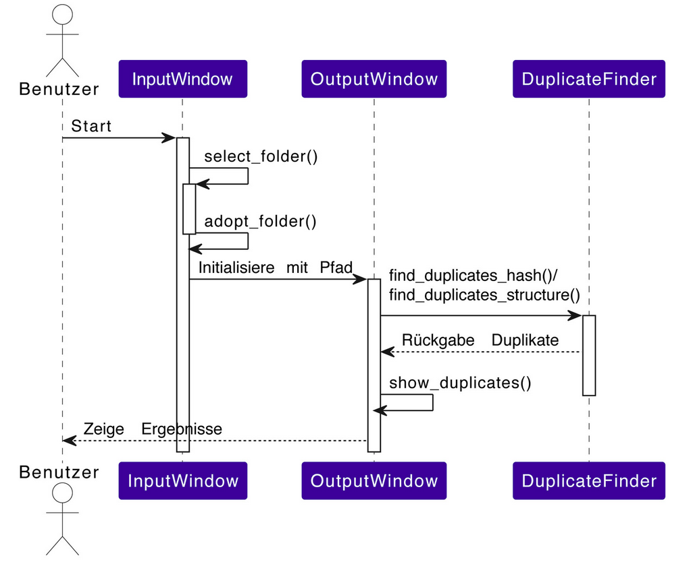
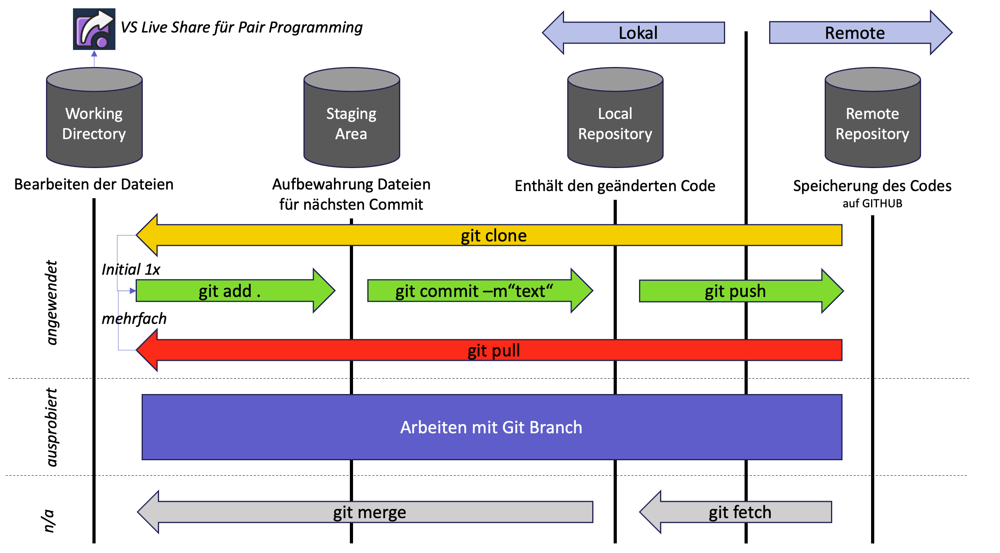
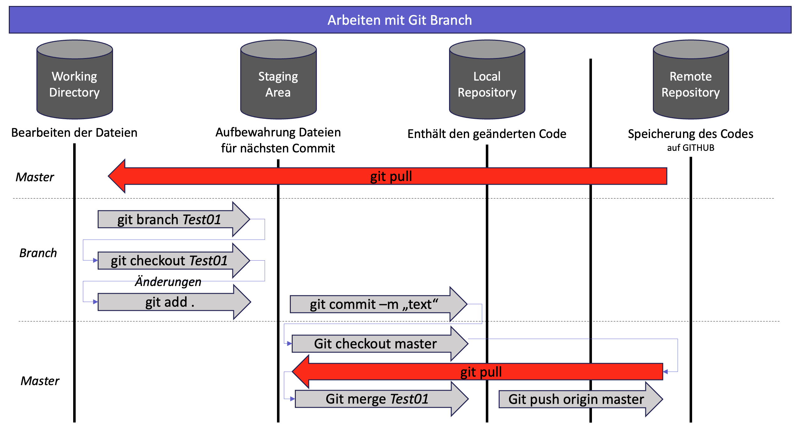

# Duplikatserkennung
## Konzipierung und Entwicklung einer Software, welche für die Identifizierung von Duplikaten von Bildern verwendet werden kann

### Ziele

Die vorliegende Arbeit verfolgt das zentrale Ziel, eine effiziente Python-Software zu entwickeln, die in der Lage ist, Duplikate in Bildern zu erkennen. Der Fokus liegt dabei auf der praktischen Anwendung von Python, insbesondere im Kontext des Bildverarbeitungsbereichs. Diese Software wurde gezielt konzipiert, um Studierenden eine praxisorientierte Lernumgebung zu bieten, in der sie ihre Python-Kenntnisse vertiefen und gleichzeitig Einblicke in die Herausforderungen der Bilderkennung gewinnen können.

Im Rahmen dieser Arbeit werden folgende spezifischen Ziele verfolgt: 

- Entwicklung von Clean Code: Das Hauptziel ist die Entwicklung einer Software mit sauberem, gut strukturiertem Code, der leicht verständlich und wartbar ist. 
- Effiziente Duplikaterkennung: Die Software sollte Duplikate in Bilddateien effizient und genau identifizieren, wobei sauberer Code und effektive Algorithmen eingesetzt werden. 
- Bildqualitätsbewertung und Verbesserung: Die Software sollte die Bildqualität bewerten und bei Duplikaten das qualitativ bessere Bild behalten, wobei Test Driven Development (TDD) und Unittesting verwendet werden, um die Qualität sicherzustellen. 
- Benutzerfreundliche Oberfläche: Die Benutzeroberfläche sollte intuitiv und benutzerfreundlich sein, unter Berücksichtigung der Benutzererfahrung. 
- Integration von Version Control (z. B. Git): Die Software sollte Mechanismen zur Versionierung und Verfolgung von Änderungen im Quellcode integrieren und die Vorteile des Version Control Systems nutzen. 
- Kollaborative Entwicklung mit Pair Programming: Die Studierenden arbeiten in Paaren, um die Entwicklung zu beschleunigen und sicherzustellen, dass bestmöglicher Code entsteht. 
- Unittesting: Die Softwareentwicklung sollte Testfälle erstellen und Unittesting durchführen, um sicherzustellen, dass die Software ordnungsgemäss funktioniert.

### Zielgruppe
- Fotografen
- Alle, die eine digitale Bildersammlung haben

  
### Anforderungen an die Software

| Nr. | Gruppierung | Kurzbeschreibung | Priorität | Beschreibung  | Softwareversion |
|----------|----------|----------|----------|----------|----------|
|1|Bildverarbeitung|Bilder öffnen und analysieren|1 – MUSS|Die Software sollte in der Lage sein, Bilder vom lokalen Computer zu öffnen und deren Eigenschaften zu analysieren. Dies ist die Grundlage für die Duplikatserkennung.|1.0|
|2|Duplikatserkennung|Duplikate mithilfe von Bildhashing identifizieren|1 – MUSS|Die Software sollte Bilder in eindeutige Hashwerte umwandeln und diese Hashwerte vergleichen, um Duplikate zu identifizieren.|1.0|
|3|Duplikatliste|Duplikatliste erstellen und Bilder löschen|1 – MUSS|Nach der Identifizierung von Duplikaten sollten diese in einer übersichtlichen Liste angezeigt werden, um den Benutzern die Überprüfung zu erleichtern und Bilder löschen zu können.|1.0|
|4|Benutzeroberfläche|Entwickeln einer Benutzeroberfläche|1 – MUSS|Die Software sollte eine Benutzeroberfläche für Benutzer bereitstellen, um die Anwendung zu steuern und Ergebnisse anzuzeigen.|1.0|
|5|Ähnliche Dateien|Identifizieren ähnlicher Dateien|3 – KANN|Die Software kann in der Lage sein, nicht nur Duplikate, sondern auch ähnliche Dateien basierend auf Bildinhalt oder Metadaten zu identifizieren.|2.0|

## Los geht's

Um das Python-Programm zu starten, sollte der Benutzer die Datei mit dem Hauptcode ausführen. In diesem Fall ist die Hauptdatei diejenige, die die GUI initialisiert und das Hauptprogramm startet. Das ist die Datei, die die tkinter-Bibliothek verwendet.

Die Benutzer sollten in der Kommandozeile (Terminal) den folgenden Befehl ausführen, um das Programm zu starten:

``
    python main.py
``

Bevor das Programm ausgeführt wird, müssen auch die entsprechenden verwendeten Bibliotheken installiert werden. Alle Bibliotheken, die im Voraus installiert werden müssen, sind im requirements.txt abgelegt.

``
    pip install -r requirements.txt
``

Die verwendeten Bibliotheken im Code sind folgende:

**Eingebaute Python-Bibliotheken:**

- os: Für plattformunabhängige Betriebssystemfunktionen.
- tkinter und ttk: Die Standard-GUI-Bibliothek für Python, die für die Erstellung der grafischen Benutzeroberfläche (GUI) verwendet wird.

**Bibliotheken von Drittanbietern:**
- PIL (Python Imaging Library): Eine integrierte Python-Bibliothek, die Operationen auf dem Betriebssystem ermöglicht, hier insbesondere für Datei- und Verzeichnisoperationen.
- ImageTk (Teil von PIL): Für die Integration von Bildern in Tkinter.
- filedialog (aus tkinter): Für den Dateidialog zum Auswählen von Ordnern.
- ttk (Teil von tkinter): Für einige spezielle Widgets in Tkinter, wie Label und Button.
- skimage (scikit-image): Für die Bildverarbeitung, Bildvergleich und Transformationen.
- imagehash: Für die Erzeugung von Bildhashes.
- messagebox (aus tkinter): Für das Anzeigen von Meldungen.

Diese Bibliotheken werden für die Erstellung einer GUI-Anwendung zur Duplikatserkennung von Bildern verwendet.
Nachdem diese Schritte abgeschlossen sind, kann der Benutzer das Programm durch Ausführen des oben genannten python-Befehls starten.

## Verstehen der Quelle

### Warum eine Duplikatssoftware? (Nutzen)

Wir haben diese Software zur Duplikaterkennung entwickelt, um in der heutigen schnelllebigen Welt, in der sich ständig grosse Mengen doppelter Bilder ansammeln, eine praktische Lösung zu bieten. Die Hauptmotivation unserer Arbeit ist es, den Speicherplatz zu optimieren, der durch diese redundanten Bilder unnötig belegt wird.

Mit dem Entfernen der Duplikate wird der Benutzer automatisch beim Organisieren/Aufräumen grosser Mengen an Bildern unterstützt. Heutzutage, wo Zeit von entscheidender Bedeutung ist, ist unsere automatisierte Lösung ein praktischer Helfer.

### Projektstruktur

Das Hauptprogramm besteht aus drei Klassen: InputWindow, DuplicateFinder und OutputWindow.

> **InputWindow** kümmert sich um die Benutzeroberfläche (GUI) für die Eingabe des Ordners mit den zu prüfenden Bildern.

> **DuplicateFinder** ist für die eigentliche Duplikatserkennung verantwortlich. Es wird nach doppelten Bilder in einem angegebenen Verzeichnis gesucht. Es können dabei zwei unterschiedliche Methoden angewendet werden: Die Methode find_duplicates_hash nutzt den Durchschnitts-Hash von Bildern, um Duplikate zu identifizieren. Dabei werden Hashes für jedes Bild erstellt und verglichen. Die Methode find_duplicates_structure verwendet die strukturelle Ähnlichkeit von Bildern.
Beide Methoden unterstützen die Bildformate ".png", ".jpg", ".jpeg", ".gif" und ".bmp". 

> **OutputWindow** erstellt ein Fenster zur Anzeige von Duplikatserkennungsergebnissen. Benutzer können Bilder direkt im Verzeichnis löschen, indem sie Checkboxen auswählen und auf "Ausgewählte löschen" klicken. Die Methode delete_selected_images führt das Löschen durch. Die Fortschrittsanzeige (progressbar) wird während der Duplikatserkennung aktualisiert, um den aktuellen Fortschritt anzuzeigen. Die Klasse ist darauf ausgerichtet, eine benutzerfreundliche Interaktion mit den Ergebnissen der Duplikatserkennung zu ermöglichen.

### Sequenzdiagramm

### Funktionsweise
Der Code implementiert eine GUI-Anwendung zur Duplikatserkennung von Bildern in einem ausgewählten Ordner mit den zu prüfenden Bildern. Der Benutzer wählt einen Ordner aus, gibt die Methode (Hash- oder Struktur-basiert) und einen Ähnlichkeitsschwellenwert für die Methode "Struktur-basiert" an. Das Programm erkennt Duplikate und ermöglicht dem Benutzer, Bilder zu löschen. Die Fortschrittsleiste zeigt den Scan-Fortschritt an.

### Clean Code
In Bezug auf Clean Code wurde folgendes umgesetzt: 
- Gemeinsame Funktionalität in eigene Funktionen und Klassen ausgelagert
- Weglassen, was aktuell wirklich nicht gebraucht wird
- Unverständlicher Code korrigiert
- Regeln für die Benennung von Variablen und Klassen vereinbart
- Nur Kommentare verwendet, wo dies nicht anders möglich ist
- Vor einem Checkin haben wir den Code durch eine zweite Person überprüft (4-Augen-Prinzip)
- Pair Programming
- Diagramme der beteiligten Komponenten gezeichnet, Abläufe skizziert
- Die Argumente der Label-Funktion sind auf separate Zeilen aufgeteilt, um die Lesbarkeit zu verbessern.
- Namenskonvention: Snake Case: functions meine_funktion oder class benutzer_verwaltung
- Namen, die die Absicht und Verwendung der Variable klar widerspiegeln
- Abgekürzte oder unklare Namen werden vermieden. Single-Letter-Namen werden vermieden. Klarheit geht vor Kürze.
- Vermeidund von magischen Zahlen: Wir benutzen Konstanten für magische Zahlen, um dem Code Lesbarkeit zu verleihen.
- Sprache: Englisch im Code (Funktionen, Klassen, Variablen etc.), Kommentare als Hilfestellung auf Deutsch

### Version Control 
Die Versionsverwaltung ist ein essentielles Instrument in der Softwareentwicklung, das dazu dient, verschiedene Ziele zu erreichen: 

- **Änderungszeitpunkte finden:**
Versionsverwaltung zeichnet jede Änderung auf.
Befehle wie "git log" zeigen Änderungsverlauf.
Wiederherstellen alter Stände:

- **Rückkehr zu vorherigen Codezuständen möglich.**
"git checkout" oder "git revert" für Rückschritte.

- **Zusammenarbeit vereinfachen:**
Ermöglicht paralleles Arbeiten mehrerer Entwickler.
Automatische Merging von Code-Änderungen.
Branching für unabhängige Feature-Entwicklung.

- **Backup des Source Code:**
Effizientes Backup-System.
Jeder Commit repräsentiert stabilen Codezustand.
Vollständige Historie des Projekts im Repository.

Diese Projektarbeit verwendet GIT als Versionsverwaltungssystem, um Änderungszeitpunkte zu verfolgen, alte Stände wiederherzustellen, die Zusammenarbeit zu erleichtern und einen zuverlässigen Backup-Mechanismus für den Source Code zu gewährleisten. Die Verwendung von Versionsverwaltungssystemen wie Git bietet also nicht nur eine effektive Möglichkeit, den Code zu sichern, sondern verbessert auch die Zusammenarbeit und ermöglicht eine präzise Rückverfolgung von Änderungen im Code.

### Testing
Erster Testlauf: Duplikatserkennung in Python

Die Duplikatserkennungssoftware wurde entsprechend getestet, um die Effektivität und Genauigkeit unter verschiedenen Bedingungen zu bewerten. Hier sind die Testfälle, die durchgeführt wurden:

- Graustufen- und Duplex-Bilder: Die Software wurde darauf getestet, Duplikate zu erkennen, die in Graustufen konvertiert wurden sowie in Duplex-Modus, der nur zwei Farbtöne verwendet.

- Gedrehte Bilder: Die Erkennung wurde mit Bildern durchgeführt, die um verschiedene Winkel gedreht wurden, um die Robustheit gegenüber Orientierungsänderungen zu überprüfen.

- Bilder mit Zusätzen: Getestet wurde auch, ob die Software kleine Änderungen wie gekritzelte Linien auf den Bildern erkennen kann.

- Verschiedene Auflösungen: Die Duplikatserkennung wurde auf Bilder mit unterschiedlichen Auflösungen angewendet, um die Skalierbarkeit der Software zu testen.

- Transparenz: Es wurde überprüft, ob die Software Duplikate ohne Hintergrund, also mit transparenten Bereichen, erkennen kann.

- Leicht abweichende Bilder: Schliesslich wurde die Fähigkeit der Software getestet, ähnliche, aber nicht identische Bilder zu identifizieren.

Die Ergebnisse dieser Tests geben Aufschluss über die Anpassungsfähigkeit und Genauigkeit unserer Software und liefern wichtige Erkenntnisse für die weitere Optimierung.

Die Duplikatserkennungssoftware hat in unserem ersten Testlauf (Version 1) gute Ergebnisse gezeigt und nahezu alle gestellten Aufgaben mit einer Erfolgsrate von 100% gemeistert. Einzig bei der Unterscheidung zwischen identischen und ähnlichen Bildern gab es Herausforderungen, die nicht vollständig erfolgreich waren. 
Dieses Ergebnis half uns dabei, unseren Code noch so anzupassen, dass in einem zweiten Testlauf (Version 2) auch die ähnlichen Bilder erkannt wurden. Dafür wurde der Schwellwert auf 70% reduziert. Anschliessend wurden sogar die ähnlichen Bilder von der Software erkannt.

Die Implementierung der Bildlöschfunktion wurde zuerst als optionale Anforderung betrachtet und war daher in den Tests nicht explizit aufgeführt. Dennoch wurde diese Funktion erfolgreich eingeführt, da ausreichend Zeit zur Verfügung stand und sie sich als äußerst hilfreich und effizient bei der Bereinigung der lokalen Bibliothek erwiesen hat. 

## Erweiterungen

1. Integration von Cloud-Services:
Die Weiterentwicklung der Bilderkennungssoftware sieht die Implementierung einer Cloud-Anbindung vor. Dadurch erhalten Benutzer die Möglichkeit, auf ihre in der Cloud gespeicherten Bilder zuzugreifen und diese nahtlos in die Software einzubinden.

2. Mobile Anwendung mit Fokus auf Benutzerfreundlichkeit:
Ein weiteres Ziel besteht darin, eine mobile Anwendung zu entwickeln, die nicht nur über eine ansprechende Benutzeroberfläche verfügt, sondern auch eine intuitive Nutzung ermöglicht. Diese Anwendung soll es den Nutzern erleichtern, Duplikate auf ihren Mobilgeräten zu identifizieren und effizient zu organisieren.

3. Verbesserung des grafischen Benutzeroberfläche (GUI):
Die Gestaltung des GUIs soll weiter optimiert und verschönert werden, um das Nutzererlebnis (UX) noch benutzerfreundlicher und ansprechender zu gestalten. Durch eine verbesserte visuelle Darstellung sollen Anwender eine angenehmere Interaktion mit der Software erleben.

4. Bildqualitätsbewertung für optimale Bildauswahl:
Ein wichtiger Aspekt der Softwareerweiterung ist die Integration einer Bildqualitätsbewertung. Mithilfe von Metriken wie Schärfe, Farbintensität und Kontrast soll die Software die Bildqualität analysieren. Dadurch kann die Anwendung automatisch das Bild mit höherer Qualität auswählen und beibehalten, um eine optimale Auswahl für die Benutzer zu gewährleisten.

## Lessons learned
- **Einrichtung der Konsole**: Die sorgfältige Einrichtung der Entwicklungskonsole ist von entscheidender Bedeutung. Wir haben erkannt, wie wichtig es ist, eine stabile und effiziente Arbeitsumgebung zu schaffen, die das Debugging und Testen der Software erleichtert.
- **Keine Grossbuchstaben bei Funktionen und Variablen**: In Python sollten Funktionen üblicherweise im Snake-Case-Format geschrieben werden, zum Beispiel "meine_funktion", anstelle von Camel Case oder der Verwendung von Großbuchstaben für Funktionen und Variablen.
- **Vertrauen in die Versionsverwaltung gewinnen**: Das Vertrauen in die Versionsverwaltung war nicht von Anfang an gegeben. Erst nach der konsequenten Anwendung der Git-Versionserwaltung und der vorgängigen Verinnerlichung der Theorie, hat sich ein Grundvertrauen ergeben.​
- **Learning by Doing**: Lernen durch praktische Anwendung und Ausprobieren
